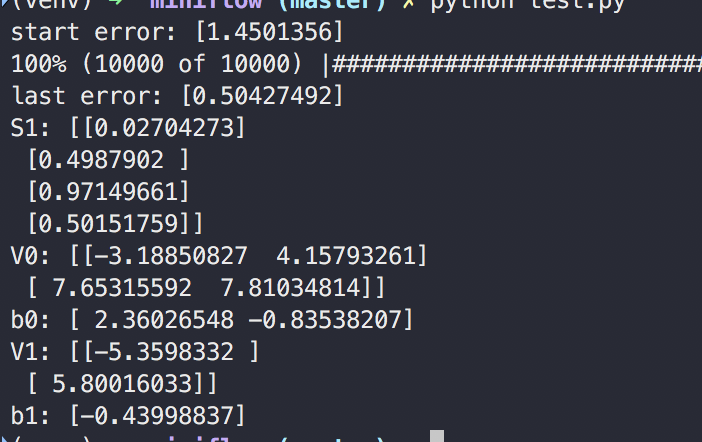

# Miniflow

## What is miniflow?

Miniflow is a implementing project of tensorflow-like functions, utilities just for studying.
It may be a very-easy, most basic version of Deep-learning framework

## Learning XOR Test

Simple logistic regression
    - 2 Input (x)
    - 2 HiddenLayer (S0 = sigmoid(x * V0 + b0))
    - 1 Output (S1 = sigmoid(S0 * V1 + b1))

## TODO

- [x] Basic Graph Node
- [x] XOR learning test
- [x] Concat, Select - not tested
- [x] Transpose
- [x] Shape validations
- [ ] Convolution2D, MaxPool, AvgPool etc...
