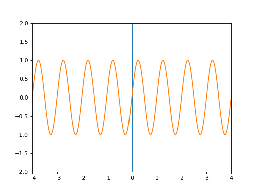

# Miniflow

## What is miniflow?

Miniflow is a implementing project of [tensorflow](https://github.com/tensorflow/tensorflow)-like functions, utilities just for studying.
It may be a very-easy, most basic version of Deep-learning framework

## How to try

```sh
git clone https://github.com/smilu97/miniflow
cd miniflow
virtualenv venv -p python3
source venv/bin/activate
pip install -r requirements.txt
python test.py
```

## Learning XOR Test


Simple logistic regression

- 2 Input (x)
- 2 HiddenLayer (S0 = sigmoid(x * V0 + b0))
- 1 Output (S1 = sigmoid(S0 * V1 + b1))
  
### [Graph building example](test/xor.py)

```python
sess = fl.Session(lr=0.1)

train_x = np.array([[0, 0],
    [0, 1],
    [1, 0],
    [1, 1]])
train_y = np.array([[0],[1],[1],[0]])

x = fl.Placeholder(sess, train_x, 'x')

y = fl.Placeholder(sess, train_y, 'y')

V0 = fl.Variable(sess, fl.xavier(2,2))
b0 = fl.Variable(sess, fl.xavier(2))
S0 = fl.sigmoid(fl.matmul(x, V0) + b0)

V1 = fl.Variable(sess, fl.xavier(2,1))
b1 = fl.Variable(sess, fl.xavier(1))
S1 = fl.sigmoid(fl.matmul(S0, V1) + b1)

E = fl.sum(fl.square(S1 - y), axis=0)
```

### [Graph building example2](test/sin.py)



```python
input_size = 1 # Constant
h1 = 1000
h2 = 1000
output_size = 1 # Constant
batch_size = 200

sess.fan_in = input_size # For xavier initializer
sess.fan_out = output_size

x = fl.Placeholder(sess, np.zeros((batch_size, 1)), 'x')
y = fl.Placeholder(sess, np.zeros((batch_size, 1)), 'y')

S0, W0, b0 = fl.fully_conntected(x, h1, activation=fl.tanh, initializer=fl.xavier_initializer())
S1, W1, b1 = fl.fully_conntected(S0, h2, activation=fl.tanh, initializer=fl.xavier_initializer())
S2, W2, b2 = fl.fully_conntected(S1, output_size, activation=None, initializer=fl.xavier_initializer())

y_ = S2
E = fl.avg(fl.avg(fl.square(y - y_), 0), 0)
```

## TODO

- [x] Basic Graph Node
- [x] XOR learning test
- [x] Concat, Select - not tested
- [x] Transpose
- [x] Shape validations
- [x] Convolution2D
- [ ] MaxPool, AvgPool etc...
